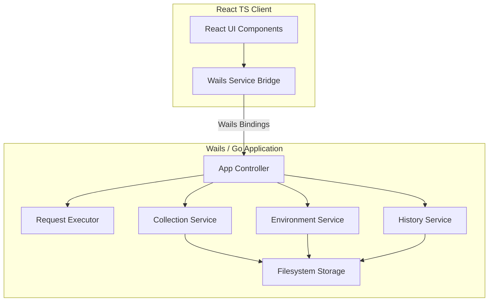

# Setu Architecture

This document describes the high-level architecture and system components of Setu, a lightweight, local-first API desktop client.

## System Components

### 1. Frontend Layer
*   **React & TypeScript:** Handles the UI components and pages (Dashboard, HTTP Client, Settings).
*   **Lucide Icons:** Provides sleek UI iconography.
*   **Wails Binding Service:** A wrapper that securely interfaces with bound Go methods or fails back to mock client utilities when run in standalone web browsers.

### 2. Backend Layer
*   **App Controller (`internal/app`):** Manages Wails runtime events and binds backend features to the UI.
*   **Request Package (`internal/request`):** Manages composing and executing HTTP API requests using the Go native net/http Client.
*   **Collection Package (`internal/collection`):** Handles grouping, folder trees, and persisting groups of requests.
*   **Environment Package (`internal/environment`):** Interpolates placeholders (e.g., `{{baseUrl}}`) with active variables.
*   **History Package (`internal/history`):** Logs executed requests and responses up to a maximum history threshold.
*   **Storage Package (`internal/storage`):** Manages path resolution and file writes/reads locally on disk.
